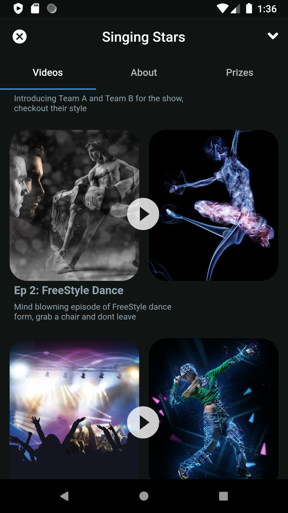

# flutter_stream_app_ui

A Streaming application UI design in flutter.

# Key Points:

Custom Page Route for Navgation.    
Transparent BottomNavigationAppBar.    
NestedScrollView for Tabs & SliverAppBar.   
Smooth Transistions across widgets.  

## Coming up:

Animated Icons

## ScreeShots:

### Screen 1:

### Screen 2:

### Screen 3:

### Screen 4:

